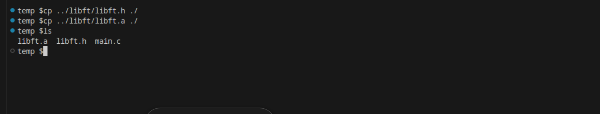
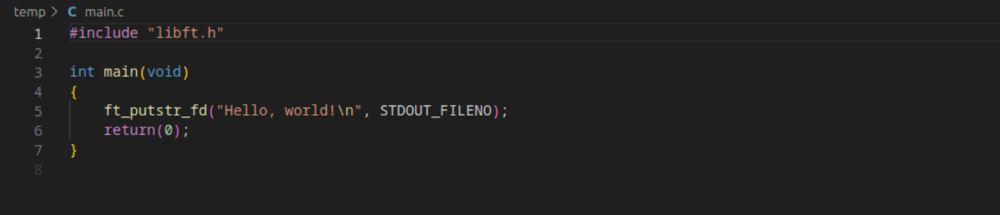
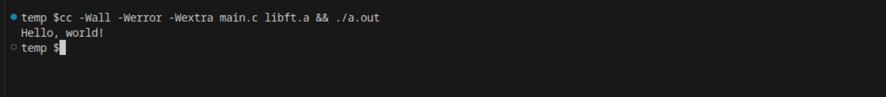
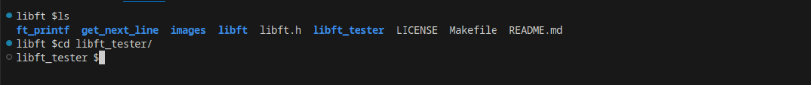
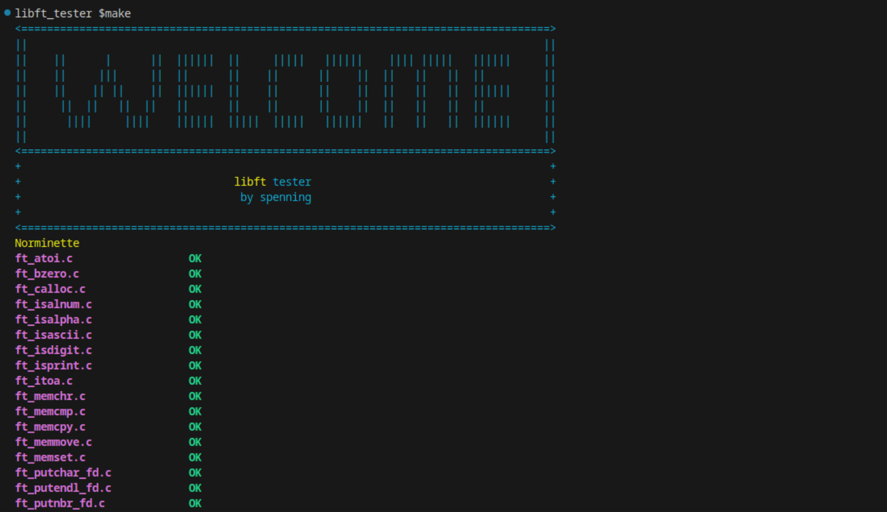

<!-- PROJECT LOGO -->
<br />
<div align="center">
  <a href="https://github.com/sebastianpenning/libft">
    
  </a>
  <h3 align="center">libft</h3>

  <p align="center">
    libft is a library with functions that are useful for the Codam curriculum
    <br />
    <a href="https://github.com/sebastianpenning/libft">
  </p>
</div>


# About The Project

  
libft is the first project at Codam. Here we created a library that we will use during the rest of our curriculum.  


# Getting Started

This is an example of how you may give instructions on setting up your project locally.

To get a local copy up and running follow these simple example steps.


# Installation
1. Clone the repo, --recursive flag is for submodules, and is necessary.


```sh

git clone https://github.com/sebastianpenning/libft.git --recursive

```
2. cd into directory

```sh

cd libft

```

3. Call the Makefile 

```sh

make

```

4. Copy libft.a and libft.h files over to working directory

```sh

cp {location}/libft.h {working directory}
cp {location}/libft.a {working directory}

```

<a href="https://github.com/sebastianpenning/libft">
  
</a>

# Usage

1. Include libft.h file and libft function in project.

<a href="https://github.com/sebastianpenning/libft">
  
</a>


2. Compile with cc

```sh
cc -Wall -Werror -Wextra {project_files.c} libft.a && ./a.out
```

<a href="https://github.com/sebastianpenning/libft">
  
</a>


# Tester

The libft tester includes tests for libft, printf, and get_next_line with both unit tests and norminette
tests for all files included. In the future memory tests are planned to be added.

1. cd into libft_tester

<a href="https://github.com/sebastianpenning/libft">
  
</a>

2. Make tests

<a href="https://github.com/sebastianpenning/libft">
  
</a>


# License

Distributed under the MIT License. See `LICENSE.txt` for more information.

 
# Acknowledgments

* [Codam](https://www.codam.nl/about-codam) 


<!-- MARKDOWN LINKS & resources/IMAGES -->

[license-url]: https://github.com/sebastianpenning/libft/blob/main/LICENSE

[C]:https://img.shields.io/badge/-c-black?logo=c&style=social

[C-url]: https://www.learn-c.org/
  

