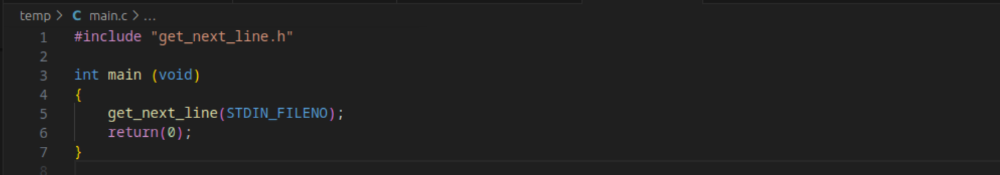

<!-- Improved compatibility of back to top link: See: https://github.com/othneildrew/Best-README-Template/pull/73 -->

<a  name="readme-top"></a>

<!--

*** Thanks for checking out the Best-README-Template. If you have a suggestion

*** that would make this better, please fork the repo and create a pull request

*** or simply open an issue with the tag "enhancement".

*** Don't forget to give the project a star!

*** Thanks again! Now go create something AMAZING! :D

-->

<!-- PROJECT SHIELDS -->

<!--

*** I'm using markdown "reference style" links for readability.

*** Reference links are enclosed in brackets [ ] instead of parentheses ( ).

*** See the bottom of this document for the declaration of the reference variables

*** for contributors-url, forks-url, etc. This is an optional, concise syntax you may use.

*** https://www.markdownguide.org/basic-syntax/#reference-style-links

-->

[![Contributors][contributors-shield]][contributors-url]
[![Forks][forks-shield]][forks-url]
[![Stargazers][stars-shield]][stars-url]
[![Issues][issues-shield]][issues-url]
[![MIT License][license-shield]][license-url]


<!-- PROJECT LOGO -->

<br />
<div align="center">
  <a href="https://github.com/sebastianpenning/get_next_line">
    
  </a>

  <h3 align="center">get_next_line</h3>

  <p align="center">
    get_next_line is about getting a line from a file descriptor
    <br />
    <a href="https://github.com/sebastianpenning/get_next_line"><strong>Explore the docs »</strong></a>
    <br />
    <br />
    <a href="https://github.com/sebastianpenning/get_next_line">View Demo</a>
    ·
    <a href="https://github.com/sebastianpenning/get_next_line/issues">Report Bug</a>
    ·
    <a href="https://github.com/sebastianpenning/get_next_line/issues">Request Feature</a>
  </p>
</div>


<!-- TABLE OF CONTENTS -->

<details>
<summary>Table of Contents</summary>
<ol>
<li>
<a  href="#about-the-project">About The Project</a>
<ul>
<li><a  href="#built-with">Built With</a></li>
</ul>
</li>
<li>
<a  href="#getting-started">Getting Started</a>
<ul>
<li><a  href="#installation">Installation</a></li>
</ul>
</li>
<li><a  href="#usage">Usage</a></li>
<li><a  href="#roadmap">Roadmap</a></li>
<li><a  href="#license">License</a></li>
<li><a  href="#acknowledgments">Acknowledgments</a></li>
</ol>
</details>


<!-- ABOUT THE PROJECT -->

# About The Project

  
get_next_line is a project at Codam that teaches you about static variables, file descriptors, and how to mitigate memory leaks.  


<p  align="right">(<a  href="#readme-top">back to top</a>)</p>


# Built With

* [![C][C]][C-url]

<p  align="right">(<a  href="#readme-top">back to top</a>)</p>

<!-- GETTING STARTED -->

# Getting Started

  

This is an example of how you may give instructions on setting up your project locally.

To get a local copy up and running follow these simple example steps.


# Installation
1. Clone the repo


```sh

git clone https://github.com/sebastianpenning/get_next_line.git

```
2. cd into directory

```sh

cd get_next_line

```

<!-- USAGE EXAMPLES -->

1. Include get_next_line.h file and get_next_line function in project.

<a href="https://github.com/sebastianpenning/get_next_line">
  
</a>


2. Compile with cc

```sh
cc -Wall -Werror -Wextra {project_files.c} get_next_line.a && ./a.out
```


# Tester

The gnl tester includes both unit tests and norminette tests for all files included. In the future memory tests are planned to be added.

1. cd into get_next_line_tester

2. Make tests


<!-- ROADMAP -->

# Roadmap

- [ ]

See the [open issues](https://github.com/sebastianpenning/get_next_line/issues) for a full list of proposed features (and known issues).

<p  align="right">(<a  href="#readme-top">back to top</a>)</p>

<!-- LICENSE -->

# License

Distributed under the MIT License. See `LICENSE.txt` for more information.

 
<p  align="right">(<a  href="#readme-top">back to top</a>)</p>

<!-- ACKNOWLEDGMENTS -->

# Acknowledgments

* [Codam](https://www.codam.nl/about-codam) 
* [Readme Template](https://github.com/othneildrew/Best-README-Template/tree/master)

<p  align="right">(<a  href="#readme-top">back to top</a>)</p>


<!-- MARKDOWN LINKS & IMAGES -->

<!-- https://www.markdownguide.org/basic-syntax/#reference-style-links -->

[contributors-shield]: https://img.shields.io/github/contributors/sebastianpenning/get_next_line.svg?style=for-the-badge

[contributors-url]: https://github.com/sebastianpenning/get_next_line/graphs/contributors

[forks-shield]: https://img.shields.io/github/forks/sebastianpenning/get_next_line.svg?style=for-the-badge

[forks-url]: https://github.com/sebastianpenning/get_next_line/network/members

[stars-shield]: https://img.shields.io/github/stars/sebastianpenning/get_next_line.svg?style=for-the-badge

[stars-url]: https://github.com/sebastianpenning/get_next_line/stargazers

[issues-shield]: https://img.shields.io/github/issues/sebastianpenning/get_next_line.svg?style=for-the-badge

[issues-url]: https://github.com/sebastianpenning/get_next_line/issues

[license-shield]: https://img.shields.io/github/license/sebastianpenning/get_next_line.svg?style=for-the-badge

[license-url]: https://github.com/sebastianpenning/get_next_line/blob/main/LICENSE

[C]:https://img.shields.io/badge/-c-black?logo=c&style=social

[C-url]: https://www.learn-c.org/
  

